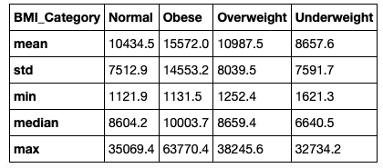
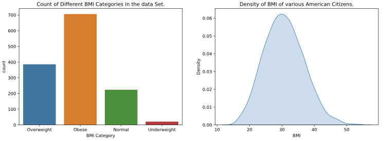

# Prabhmeet's Analysis:
First we will import pandas, and use it to read the dataset. As well as do some method cleaning, and some data Wrangling. All of that has been Chained together, in this chunk , below for the purpose of ease to read , and debug.

Also a function was built , that used method chanining to clean , process, and wrangle the data, and act as a pipeline. In this section we use that function to load in our data. The function was placed inside the scripts folder 

```python
import pandas as pd
from pandas_profiling import ProfileReport as pf
import numpy as np
from matplotlib import pyplot as plt
import seaborn as sns
%matplotlib inline

## Using a seperate file to import our functions.
from scripts import project_functions as fun
%load_ext autoreload
The autoreload extension is already loaded. To reload it, use:
  %reload_ext autoreload
```
Now we will use a pandas profiling library to get a brief overiview of our data , and look over some of the plots of our dataset.

```python
pf(dataSet).to_notebook_iframe()
```
Followowing changes were made after reading, and exploring the Profile report.

-  Using this the categorize BMI was improved, as the previous version was leaving the dataset with several nan values. 

-  Also some duplicate values were observed which were also removed(This change was made in the data processing file).
-   Also a decision was made to add a new column of BMI Category to help categorize the BMI's for easier understanding when producing plots.


Now we will explore some decriptive statistics on our dataSet.

```py
dataSet.describe().round(0).rename({'50%':'Median'}).drop(columns='Smoker_bin').T
```


The following code gives us some statistical data to explore the previous found co-relation in my EDA. 

**Conclusion** : The mean Medical charge for the Obese group is found to be the highest. Although the difference between Normal and Overweight (mean Medical Charges) does not seem to be much.

```
dataSet.groupby('BMI_Category').agg(['mean','std','median','min','max']).round(1).drop(columns={'BMI'})
```


The following code was used to explore the percentage of US Population that is under the Obese Category. During my Exploratory analysis i got an intuition, that a good amount of American citizens have higher BMI than normal , that is they have BMI more the an 24.9 which is considered unhealthy.

 - From the plots below , it can be concluded that more than 50 percentil of the US population can be categorized as having , an unhealthy BMI. 
```python
fig, ax =plt.subplots(1,2,figsize=(15,5))
sns.countplot(dataSet['BMI_Category'],ax=ax[0]).set(
	xlabel = "BMI Category",
	title="Count of Different BMI Categories in the data Set.",
	
)
sns.kdeplot(
   data=dataSet, x="BMI",fill=True,ax=ax[1]
).set(
	xlabel = "BMI",
	title="Density of BMI of various American Citizens.",
	
)

```


The following code will help us explore the relationship between BMI Category, and Medical Charges.
```python
fig, ax =plt.subplots(2,2,figsize=(15,10))

boxplot = sns.boxplot(
	data = dataSet,
	x="BMI_Category",
	y="MedicalCosts_USD",
	order=['Underweight','Normal','Overweight','Obese'],
	ax=ax[0][0]

)
boxplot.set(
	#yscale="log",
	xlabel="BMI Category",
	ylabel="Mean Medical Charges in USD",
	title="Boxplot",
)
logboxplot = sns.boxplot(
	data = dataSet,
	x="BMI_Category",
	y="MedicalCosts_USD",
	order=['Underweight','Normal','Overweight','Obese'],
	ax=ax[0][1],

)
logboxplot.set(
	yscale="log",
	xlabel="BMI Category",
	ylabel="Log Transformed Mean Medical Charges in USD",
	title="Log Transformed Boxplot",
)
barplot = sns.barplot(
	data = dataSet,
	x="BMI_Category",
	y="MedicalCosts_USD",
	order=['Underweight','Normal','Overweight','Obese'],
	ax=ax[1][1],
)
barplot.set(
	xlabel="BMI Category",
	ylabel="Mean Medical Charges in USD",
	title="Barplot",
)
sns.violinplot(
	data = dataSet,
	x="BMI_Category",
	y="MedicalCosts_USD",
	order=['Underweight','Normal','Overweight','Obese'],
	ax=ax[1][0],

).set(
	#yscale="log",
	xlabel="BMI Category",
	ylabel="Medical Charges in USD",
	title="Violon plot.",
)
fig.tight_layout(h_pad=4,w_pad=10)
plt.suptitle("Different plots comapring mean Medical Charges of American Citizens",y=1.05)
fig.show()

```


```python
fig, ax =plt.subplots(1,2,figsize=(15,5))
scatter1=sns.scatterplot(
	data=dataSet,
	x="BMI",
	y="MedicalCosts_USD",
	hue="BMI_Category",
	ax=ax[0],
	)
scatter1.set(
	xlabel="BMI",
	ylabel="Medical Charges in USD",
	title="Normal",
)
scatter1=sns.scatterplot(
	data=dataSet,
	x="BMI",
	y="MedicalCosts_USD",
	hue="BMI_Category",
	ax=ax[1]
	)
scatter1.set(
	yscale="log",
	xlabel="BMI",
	ylabel="Medical Charges in USD",
	title="Log Transformed",
)
plt.suptitle("Scatterplot Medical Charges of American Citizens",y=1)
fig.show()

```


```
regplot = sns.regplot(
	data = dataSet,
	x="BMI",
	y="MedicalCosts_USD",
)
regplot.set(
	yscale="log",
	xlabel="BMI ",
	ylabel="Medical Charges in USD",
	title="BMI vs Medical Charges of U.S. Citizens",
)
```


## EDA Concolusion

-  It does look like the obese category of , does on average have higher medical expenses. Although it was also found that, 50 percentile of Americans are actually Obese. Therefore this observation will be irrelevant , unless we are able to sample equal number of observations, and explore their mean medical Spending. 

## Research Question

-  Does having a bmi greater than 25 result, in higher medical expenses in America .

From All the above graphs we might , assume that the obese groups have higher medical bills than other groups. Although this might be biased since we have a higher count of Obese people in our population. Therefore we will now try to sample equal observations , from each of out categories.

## Note:

The above plots , and research was sourced from a different file , from my personal analysis file. In that file , the dataset was explored to have outliers, and duplicates. Which were later removed , before being presented in this file.

## Research Conclusion.

-  As per the data explored , having a BMI over 25 in America did not seem to be related with higher medical Expenses. Although it was also found that more than 50% of Americans are either Overweight or Obese as per [CDC guidelines](https://www.cdc.gov/healthyweight/assessing/index.html). Evidence was also found for being Obese or overweight and having higher Medical charges. This relation might just be due to the fact since, a good percentile of Americans are unhealthy in terms or their BMI, they also happened to be the ones with higher medical Charges. Meaning it might be just due to chance that the ones with higher medical charges also happened to be unhealthy in terms of their weight. To overcome this research barrier on having too many Individual from one group , we would have to randomly sample the dataset, and obtain equal number of subjects from each group , and then explore the mean medical spendings of the groups.
-  A seperate analysis where the Medical Dataset was randomly sampled to have equal number of perople from each Bmi cateegory was also performed. Plots and data from that dataset can be found in my personal EDA file. In that file it was concluded that there was no linear relationship between a higher bmi, and higher Medical charged in American Citizens.

